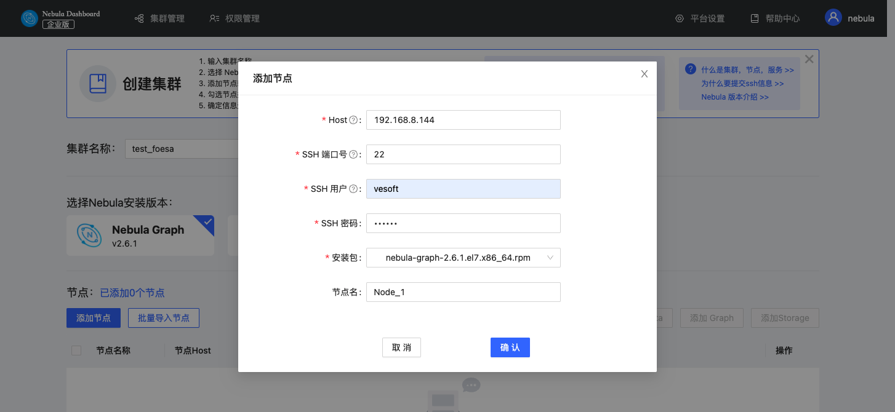
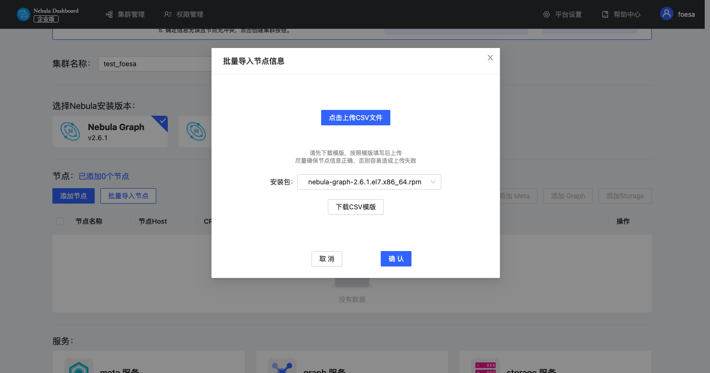
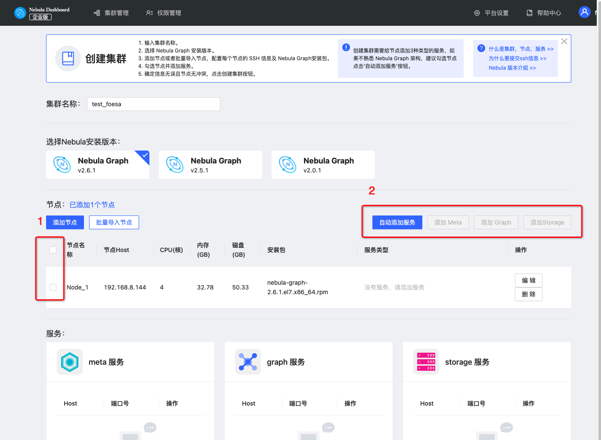
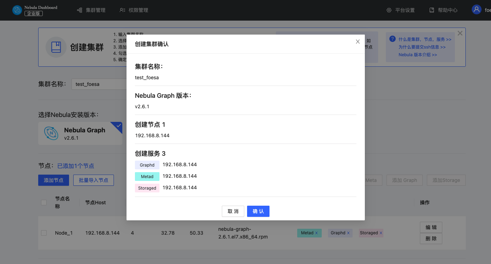

# 创建集群

本文介绍如何通过Dashboard创建集群。

## 操作步骤

按以下方式创建集群：

1. 在集群管理页面，点击 **创建集群** 标签。
2. 在创建集群页面，完成以下配置：
   - 输入 **集群名称**，最大可输入15个字符，本示例设置为`test_foesa`。
   - 选择Nebula Graph安装版本，本示例设置为`v2.6.1`。
   - **添加节点**，需要添加每个节点的相关信息。
  
     1. 配置每个Host的IP信息，本示例设置为`192.168.8.144`。
     2. 配置 SSH 信息，本示例设置如下：SSH端口号为`22`，SSH用户名为 `vesoft`，SSH 密码为`nebula`。
     3. 选择 Nebula Graph 安装包，本示例为`nebula-graph-2.6.1.el7.x86_64rpm`。
     4. （可选）输入节点名，可以对节点进行备注。本示例设置为`Node_1`。

     

   - **批量导入节点**，需要添加每个节点的相关信息。批量导入需要先选择安装包后点击**下载CSV模版**。按照模版填写后上传，尽量确保节点信息正确，否则容易造成上传失败。

     

3. 勾选节点并在节点右上方，点击需要添加的服务。创建集群需要给节点添加3种类型的服务，如果不熟悉Nebula Graph架构，建议点击 **自动添加服务** 按钮。

   

4. （可选）在下方的服务中，选择编辑meta、graph、storage服务的端口号、HTTP端口号、HTTP2端口号，点击确认保存。

5. 点击**创建集群**，确定配置信息无误且节点无冲突后，点击**确认**。

   

6. 在集群管理页面中的列表中出现状态为`installing`的集群，需等待3-10分钟，状态变为`healthy`即集群创建成功。如果服务状态为`unhealthy`，表示集群服务中存在非正常运行的服务，请点击详情进行查看。

   

## 后续操作

成功创建集群后，用户可以对集群进行操作，详情见[总览](../4.cluster-operator/1.overview.md)。
